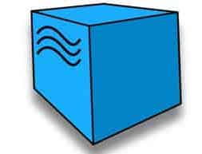

<h4>Hi there! </h1><h6 >QA-engineer from Russia 🇷🇺</h6>

## Languages and tools

<code></code>
<code></code>
<code></code>
<code></code>
<code></code>
<code></code>
<code></code>
<code></code>
<code></code>
<code></code>
<code></code>
<code></code>
<code></code>

## Дипломный проект по завершению обучения в [QA.GURU](https://qa.guru/)
### UI автотесты
[GitHub](https://github.com/Elena0808/diplom_ui)  
[Jenkins](https://jenkins.autotests.cloud/job/C02-les0808-22-ui/)  
[Allure отчет](https://jenkins.autotests.cloud/job/C02-les0808-22-ui/11/allure/)  
### API автотесты
[GitHub](https://github.com/Elena0808/diplom_api)  
[Jenkins](https://jenkins.autotests.cloud/job/C02-les0808-22-api/)  
[Allure отчет](https://jenkins.autotests.cloud/job/C02-les0808-22-api/9/allure/)  
### Mob автотесты
[GitHub](https://github.com/Elena0808/diplom_mobile)  
[Jenkins](https://jenkins.autotests.cloud/job/C02-les0808-22-mob/)  
[Allure отчет](https://jenkins.autotests.cloud/job/C02-les0808-22-mob/13/allure/)  

